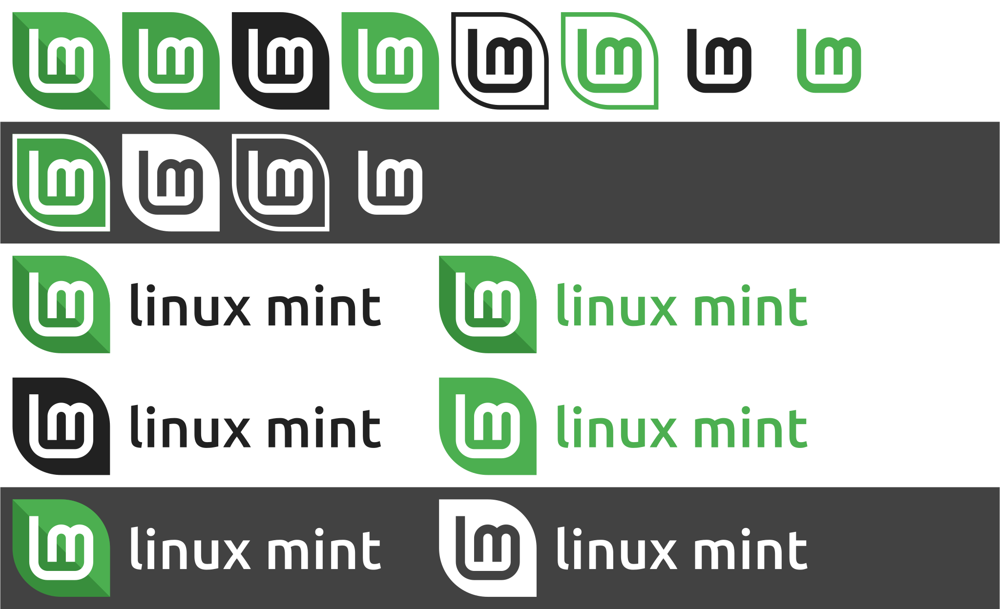
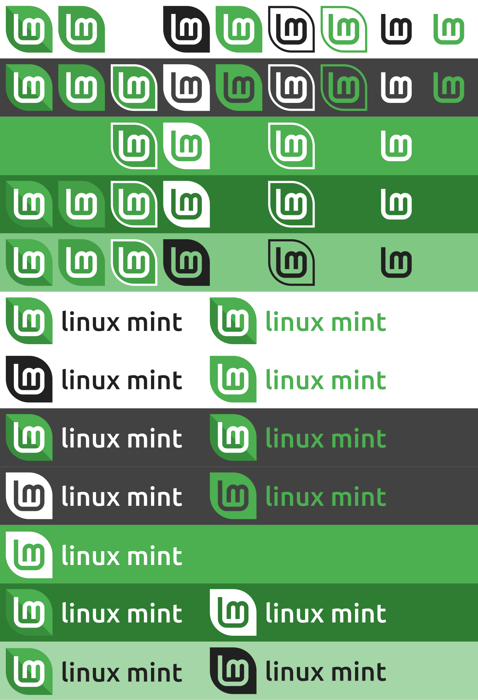
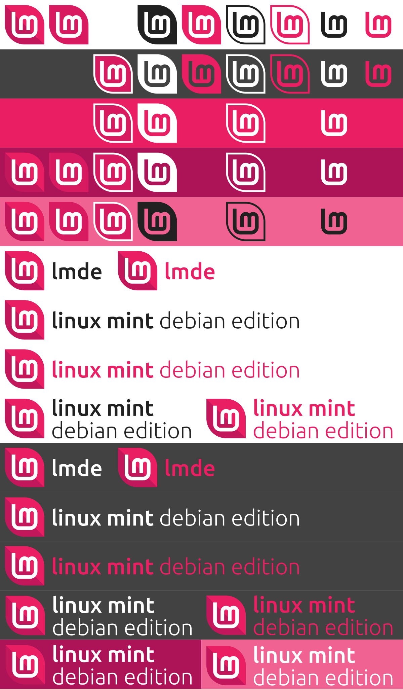

[ ![](https://img.shields.io/badge/Linux_Mint-4caf50?style=for-the-badge&logo=data:image/png;base64,iVBORw0KGgoAAAANSUhEUgAAACAAAAAgCAYAAABzenr0AAAACXBIWXMAAAHYAAAB2AH6XKZyAAAAGXRFWHRTb2Z0d2FyZQB3d3cuaW5rc2NhcGUub3Jnm%2B48GgAABFxJREFUWIXFl11MU2cYx3%2BnFAoCguEj0IJYEQQhKJRlmGwOUFjGXOTcGLMYlhh3swszZ4zMj87sZmMzTOaWLFmyLcZkZslyYpwDyQTRKeASQQPqLEsJqGCJMqAHpBXeXUCPBQoVmPi%2Fevr0%2Bfidvh%2FPqSSEECxObuBfoBNoBeqAc7IsDz1PsiSEEG2Odtoc7QsmCNGHYFpuZG1UKuGGcIBh4GegQpZlm1%2BAkzdOcbL11IIBtGKSxLqYdLas3kxx8hYMeoMbOA5YZVl%2B4itHt%2BiuXhJC0O64RVXTCd79tYzf71YHCiH2A%2FWKosS%2FcABvDTwZoLKxisN1VlSXmgdcUxQl67kAMmMz2JG5nR2Z28mMzVgUSPO9v%2FiwZh8O1ZEAVCuKYvILkGPMZrdlF7stu8gxZi8KAMDe38mhC1aG3SNG4IyiKCFzArwI2fs7%2BfzyFwiEBSj3%2BPULKRYWFMbW1BIyYtchSRI3em9y5s5ZALalvcP6uCyEELQ52jl3txqnywnA1e5G6u0NFJrz9ymK8p0syz3zBkiKXElF0WdEL4vSfHkJr7I1tQQA0%2FJnS7wxMY%2FS9G0cqD1I10AXAD9c%2F4lNSa%2BF6nX6I8AH81oCvU7P0XzrlOYemZabpjT3KGZZNEcLDhMgBQDQ6%2BzlfEctQJmiKOHzAnjFlEtiRAIAqkvl2JVKjl2pZNg9rMX48q%2BMWEmuyaLF1P7zB0AoUDIvgKTIJM2u6ThPTUctNR21VNvO%2B%2FWbV5g1%2B3bfHYYm9kXhvACCAgI1W%2FV%2Barfq1%2B%2BdOy7GsT2yAWQt2TGcrvuDDwBWvzSAyaMZoQNcet2CroNFyT3uBjDogMGwoLAlB%2FBIB9iN4T4n5ZIBtK6NSkWSpJcCoAfqwg3h76dHp3Gr7zYAY%2BNjWkCg7tnxaXvYzum2XzTbn98717vmdIDfALUoeXOoB6B%2FpF8LSIlao9nXe1q43tMyo8hs%2FtSoFM1%2BPPLYJ4BOlmUncLo4uYiI4IjJgq0IJl6Wc40WCsxv%2BEyeS4XmfCzGHAAEgpaeVp9xnvNXYdAbynZlvxf4VePX9Dp7aei8RP6qicaHNn3Mm2uKudP3N0%2Be%2Bny31BSsDyY9Jk1rDlBvb6DX%2BXB2AFmWbYqiHC9JeWt%2F871rXO1uoqrpG5JXJGvDJ9doIddo8VlkLnUPdHOi%2BdtZv%2Fe%2BCa2SJDWVv34A84pVDI0Osad6L%2FX2i9pyzEcCQZ39InuqP2JodPb%2FKFJpaan2QVGUOOCaQ3UkHrpgxd7fCUBcWBzZ8euJCY0hKCBozsauMRd9ah8tPa2z%2FuwAZRt2UrZ%2B51SASYgs4NzI05GEistf8mfXVb9PuxB5AGYMI1mWbwI5IfqQS58UHOHgpnLiX%2BBN6XMayrLcBxRLSJ8WmvPVH0u%2FZ%2B%2FGPWTEZqCT%2Ft8BOmMJpmtyX1iBMiB0yOXE9sjG%2FcEHqG4V56hzQY1zjNnkxGf7B%2FACCQPeBgqADYAZiATm3pV%2B9B%2B0wK3Jnz2ksAAAAABJRU5ErkJggg%3D%3D
)](https://github.com/Secret-chest/linuxmint-logo/blob/main/compressed/shields-io-badge.txt)

# linuxmint-logo
Material Linux Mint logos by me.

Why did I do these?

The old 2007 logo is bad. It doesn't look like a leaf, it doesn't look like anything. All alignments and spacings are messed up. The colour is also very bad. It's Linux Mint, not Linux Tea, Linux Lawn or Linux Lime. In case you didn't know, it looks like this:

The new logo by Clem is a bit better. The spacings are good, but the colour is too subdued and it loses all its personality because it's now a circle. As before, here it is:

Also, it's Linux Mint, not Linuxmint.

My logo has a leaf shape, but it's a very simple one. 50% circle, 50% square.
I also changed the colour to `#4caf50` from the Material Design palette. It's also two-tone, and the second colour is `#388e3c`.  Some might want a turquoise colour, but here is a photo of mint:

## Logos on all colours

## LMDE logos

 This work is licensed under a <a rel="license" href="http://creativecommons.org/licenses/by-sa/4.0/">Creative Commons Attribution-ShareAlike 4.0 International License</a>.
